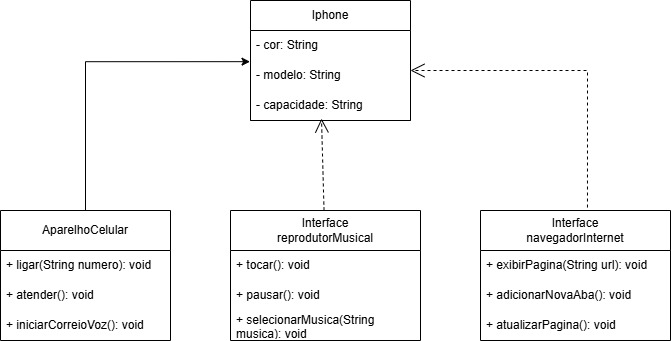

# Modelagem do Iphone com UML
Este projeto apresenta um diagrama UML para representar os principais componentes de um iPhone, destacando suas funcionalidades de telefonia, reprodução musical e navegação na internet.

## Funcionalidades:
- Classe principal que representa o aparelho e suas características.
- Interface de reprodutor musical para tocar, pausar e selecionar músicas.
- Interface de navegador de internet para exibir páginas, abrir novas abas e atualizar páginas.
- Classe de aparelho telefônico para realizar ligações, atender chamadas e acessar o correio de voz.

## Diagrama
.